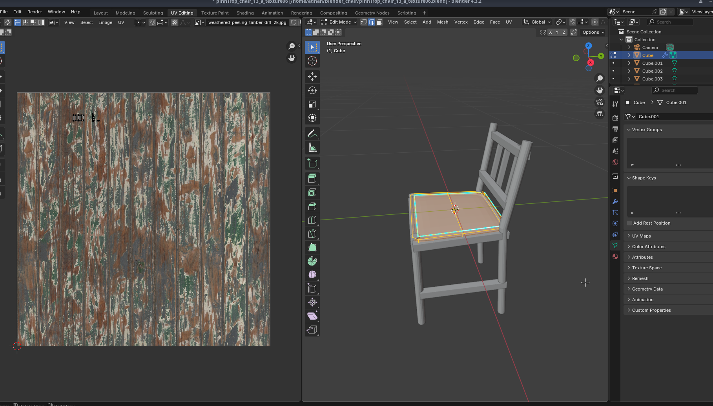
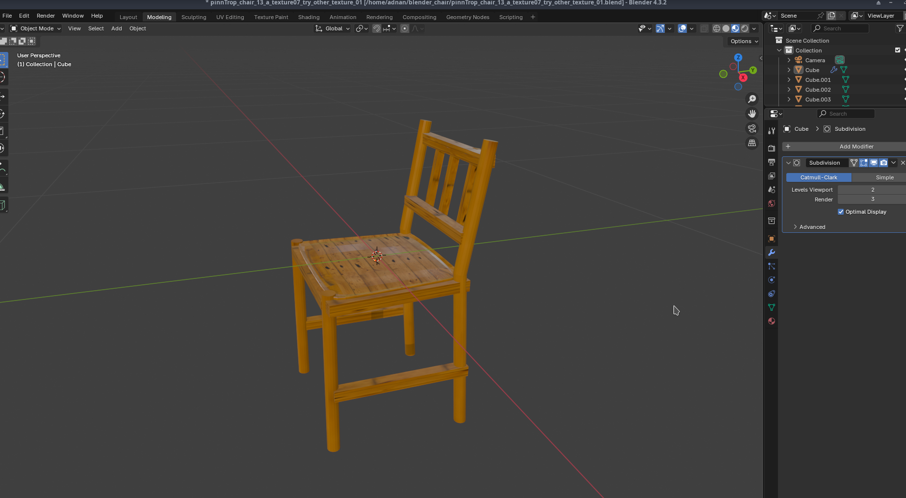
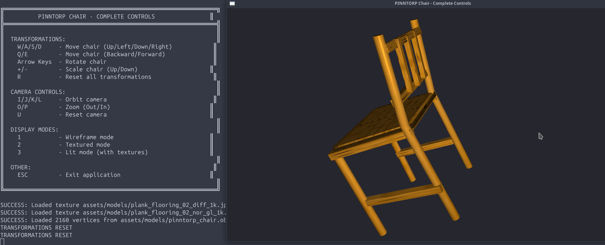
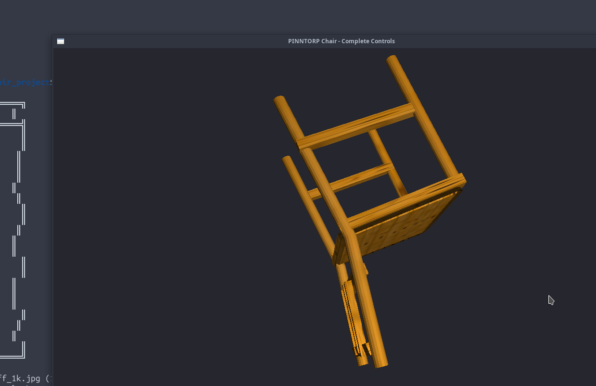
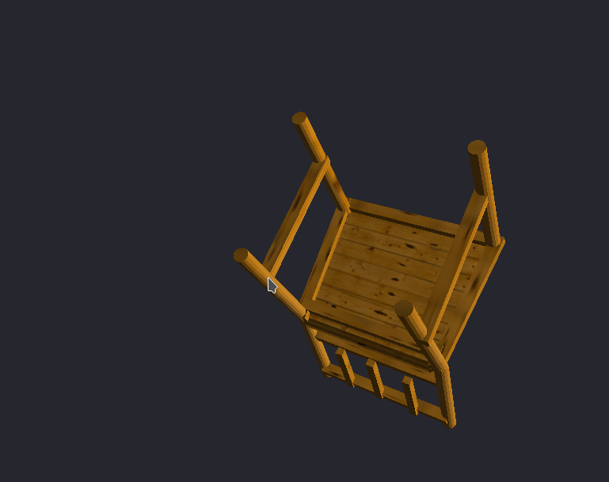
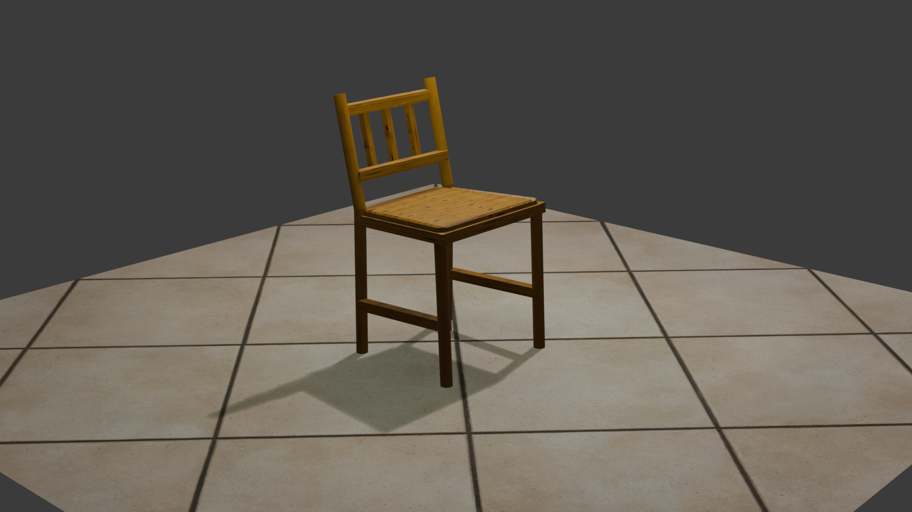

# 🪑 PINNTORP Chair - OpenGL 3D Model Viewer

[](https://github.com/adnanphp/PINNTORP-Chair-OpenGL)
[](https://github.com/adnanphp/PINNTORP-Chair-OpenGL/stargazers)
[](https://github.com/adnanphp/PINNTORP-Chair-OpenGL/network)
[](LICENSE)
[](https://www.opengl.org/)
[](https://github.com/adnanphp/PINNTORP-Chair-OpenGL)
[](https://github.com/adnanphp/PINNTORP-Chair-OpenGL/pulls)

## 📋 Overview

This project displays the **IKEA PINNTORP chair** model in an OpenGL window with keyboard-controlled transformations. The chair is rendered as a wireframe model loaded from a Blender-exported OBJ file, meeting computer graphics assignment requirements.

## ✨ Features

- 🖼️ **OpenGL Rendering** with GLFW and GLAD
- 📦 **OBJ Model Loading** from Blender export with normals and UV support
- ⌨️ **Keyboard Controls** for translation, rotation, and scaling
- 🔲 **Wireframe Display** mode (no textures required)
- 🎯 **Interactive Transformations** with real-time updates
- 🔄 **Reset Function** to restore original position

## 🎮 Controls

| Key | Action |
|-----|--------|
| **W** | Move chair **up** (Y+) |
| **S** | Move chair **down** (Y-) |
| **A** | Move chair **left** (X-) |
| **D** | Move chair **right** (X+) |
| **Q** | Move chair **backward** (Z-) |
| **E** | Move chair **forward** (Z+) |
| **R** | Rotate chair **right** |
| **F** | Rotate chair **left** |
| **↑** (Up Arrow) | Scale chair **up** |
| **↓** (Down Arrow) | Scale chair **down** |
| **Home** | Reset all transformations |

## 📸 Screenshots

### Default View


*Default wireframe view of the IKEA PINNTORP chair model loaded in OpenGL.*

### Rotated View


*Chair model rotated to show different angles and perspective.*

### Scaled View


*Chair model scaled up using the Up Arrow key.*

### Transformed View


*Chair model with combined transformations (translation + rotation).*

### Close-up View


*Close-up view showing the wireframe details of the chair geometry.*

### Multiple Transformations


*Complex transformation with translation, rotation, and scaling applied simultaneously.*

---

## 📁 Project Structure
PINNTORP-Chair-OpenGL/
├── assets/
│ └── models/
│ ├── pinntorp_chair.obj # Chair geometry
│ ├── pinntorp_chair.mtl # Material definitions
│ ├── plank_flooring_02_diff_1k.jpg # Diffuse texture
│ └── plank_flooring_02_nor_gl_1k.exr # Normal map
├── Screenshots/
│ ├── 1.png # Default view
│ ├── 2.png # Rotated view
│ ├── 3.png # Scaled view
│ ├── 4.png # Transformed view
│ ├── 5.png # Close-up view
│ └── 6.png # Multiple transformations
├── src/
│ ├── main.cpp # Main application
│ ├── obj_loader.hpp # OBJ loader header
│ └── obj_loader.cpp # OBJ loader implementation
├── shaders/
│ ├── vertex_shader.glsl # Vertex shader
│ └── fragment_shader.glsl # Fragment shader
├── glad/ # GLAD OpenGL loader
├── include/ # External includes
├── build/ # Build directory (generated)
├── build.sh # Build script
├── CMakeLists.txt # CMake configuration
└── README.md # This file

text

## 🚀 Quick Start

### Prerequisites

#### Ubuntu/Debian
```bash
sudo apt update
sudo apt install build-essential cmake libglfw3-dev libglm-dev libgl1-mesa-dev
macOS (Homebrew)
bash
brew install cmake glfw glm
Windows (vcpkg)
bash
vcpkg install glfw3 glm
Build and Run
Clone the repository

bash
git clone https://github.com/adnanphp/PINNTORP-Chair-OpenGL.git
cd PINNTORP-Chair-OpenGL
Make build script executable

bash
chmod +x build.sh
Build the project

bash
./build.sh
Run the application

bash
cd build
./chair_app
Manual Build with CMake
bash
mkdir build && cd build
cmake ..
make -j$(nproc)
./chair_app
Manual Build with g++
bash
g++ -std=c++17 src/main.cpp src/obj_loader.cpp \
    -I/usr/include/glm \
    -lglfw -lGL -ldl \
    -o chair_app
🔧 Building on Different Platforms
Linux
bash
./build.sh
cd build && ./chair_app
macOS
bash
./build.sh
cd build && ./chair_app
Windows (MinGW or Visual Studio)
bash
# Using CMake with generator
cmake -B build -G "MinGW Makefiles"
cmake --build build
cd build && ./chair_app.exe
📦 Dependencies
Dependency	Version	Purpose
OpenGL	3.3+	Graphics rendering
GLFW	3.3+	Window creation and input
GLAD	Latest	OpenGL function loading
GLM	0.9.9+	Mathematics library
🎯 Assignment Requirements Checklist
☑ OpenGL window with GLFW and GLAD
☑ Translation, rotation, scaling transformations
☑ Keyboard input controls
☑ OBJ file export from Blender
☑ Wireframe display only
☑ No textures required (though exported textures are present)
🛠️ Troubleshooting
"Failed to open OBJ file"
Ensure pinntorp_chair.obj is in assets/models/

Check file permissions with ls -la assets/models/

Verify you're running from the correct directory

"Shader compilation failed"
Verify GLSL shader files are in shaders/

Check for syntax errors in .glsl files

Ensure OpenGL 3.3+ is supported (glxinfo | grep "OpenGL version")

"GLFW/GLAD initialization failed"
Update graphics drivers: sudo apt update && sudo apt upgrade

Install missing dependencies

Check OpenGL support: glxinfo | grep "OpenGL"

Build script fails
Make build script executable: chmod +x build.sh

Check CMake version: cmake --version (requires 3.10+)

Install dependencies: sudo apt install build-essential cmake

📝 File Format Support
OBJ Format
✅ Vertex positions

✅ Normals

✅ UV coordinates

✅ Face definitions (triangulated)

MTL Format
✅ Material definitions

✅ Texture references (stored but not used in wireframe mode)

🔄 Updating the Model
Export your model from Blender as OBJ

Place the new OBJ and MTL files in assets/models/

Update the file name in src/main.cpp if needed

Rebuild the project: ./build.sh

🤝 Contributing
Fork the repository

Create a feature branch (git checkout -b feature/AmazingFeature)

Commit changes (git commit -m 'Add AmazingFeature')

Push to branch (git push origin feature/AmazingFeature)

Open a Pull Request

📄 License
This project is for educational purposes as part of a computer graphics assignment.

MIT License - See LICENSE file for details.

🙏 Credits
Chair Model: IKEA PINNTORP

Textures: plank_flooring_02 (free PBR texture)

Software: Blender 4.3.2, OpenGL 3.3

Libraries: GLFW, GLAD, GLM

📧 Contact
GitHub: @adnanphp

Project Link: https://github.com/adnanphp/PINNTORP-Chair-OpenGL

Built with ❤️ for Computer Graphics Education

Made with ❤️ using OpenGL and GLFW
